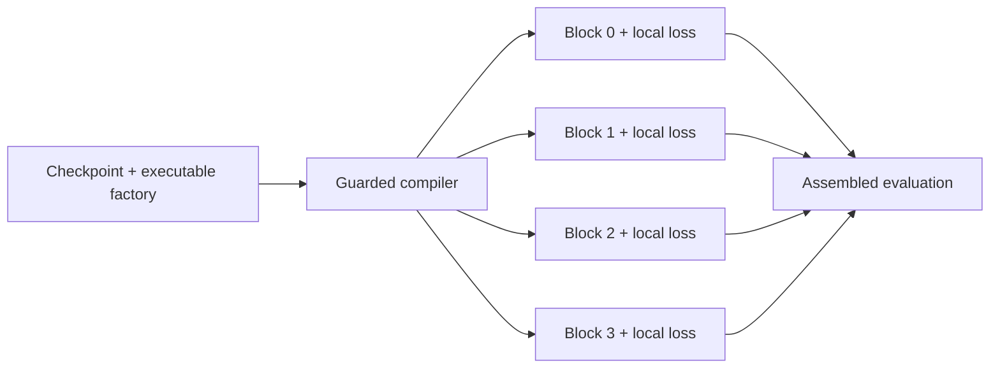

<div align="center">

# ZeroGraph

### One model. Independent jobs. Zero inter-block gradients.

An equipable blockwise training runtime for PyTorch and Hugging Face models.

[](https://github.com/Alfalfa-Labs-Inc/ZeroGraph/actions/workflows/ci.yml)
[](https://www.python.org/)
[](https://pytorch.org/)
[](LICENSE)

</div>

ZeroGraph converts a compiler-accepted residual model into independently
loadable and trainable denoising blocks. Every block owns its optimizer and
noise interval. No activation graph or gradient crosses a block boundary.

That independence is real—and so is the trade-off: ZeroGraph changes the
training objective. It does **not** claim bitwise or gradient parity with
ordinary end-to-end training. Assembled quality must be measured.

## Measured headline

Teacher-anchored TinyLlama conversion, 1.100B parameters, UltraChat, four
disjoint NVIDIA L4 GPUs:

| Primary run | Ordinary DDP SFT | ZeroGraph B=4 | Result |
|---|---:|---:|---:|
| Peak allocated HBM / GPU | 12.32 GiB | 2.67 GiB | **4.62× lower** |
| Critical compute path | 1,936.41 s | 395.20 s | **4.90× shorter** |
| Held-out response CE | 1.2791 | 1.3096 | +0.0305 nat |
| Inter-block gradient bytes | global DDP | 0 | strict independence |

The cached replay matched all four online-reference checkpoint hashes and all
held-out metrics. This is evidence for one teacher-anchored Llama-family
conversion—not a universal speed law, from-scratch language result, or proof
that arbitrary PyTorch models will compile. See [BENCHMARKS.md](BENCHMARKS.md).

## Why ZeroGraph

Traditional parallelism distributes one global backward graph. ZeroGraph
changes the topology entirely:

- one independent process or distributed group per block;
- only the active block's trainable state and backward graph need to be live;
- zero inter-block gradient traffic with frozen or private interfaces;
- FSDP, tensor parallelism, and context parallelism remain available *inside*
  a block that is still too large for one device;
- blocks can train concurrently on disjoint accelerators;
- checkpoint, resume, diagnostics, assembly, and signed-artifact workflows are
  explicit package APIs.

## Install

ZeroGraph 0.3.0 uses the ExactGraph 0.17.0 compiler/runtime without enabling
exact-rematerialization semantics for its local objective.

```bash
git clone https://github.com/Alfalfa-Labs-Inc/ExactGraph.git
python -m pip install ./ExactGraph

git clone https://github.com/Alfalfa-Labs-Inc/ZeroGraph.git
python -m pip install -e ./ZeroGraph
```

The tested distribution name remains `diffusionblocks-independent`, and the
Python import remains `diffusionblocks_independent`.

## Five-minute conversion

```python
from diffusionblocks.parity_examples import residual_factory
from diffusionblocks_independent import compile_checkpoint, inspect_program

payload = residual_factory()
program = compile_checkpoint(
    **payload,
    checkpoint=None,
    blocks=4,
)
program.save_pretrained("zerograph-program")

report = inspect_program("zerograph-program")
print(report["contract"])
```

Integer-token objectives require an explicit target codec. The compiler refuses
to guess whether an integer represents a token, class, mask, or index.

## Launch independent jobs

```bash
diffusionblocks-independent inspect \
  --program zerograph-program \
  --output zerograph-plan.json

diffusionblocks-independent launch \
  --program zerograph-program \
  --batch-factory my_project.data:make_batches \
  --steps 1000 \
  --devices 0,1,2,3 \
  --output-dir runs/zerograph
```

The launch plan records device groups, wave scheduling, seeds, optimizer
settings, timeouts, and the explicit zero-inter-block-gradient contract.

## How it works



For target representation `y`, context `x`, and block-specific noise interval
`I_b`, block `b` minimizes a local denoising objective:

```text
z_sigma = y + sigma * epsilon
L_b = E[w(sigma) * loss(D_b(x, z_sigma, sigma), y)], sigma in I_b
```

The blocks can be optimized in parallel because `grad(theta_b, L_b)` does not
require another block's activations or parameters.

## Runtime contract

`IndependentContract` is machine-readable and intentionally blunt:

```python
from diffusionblocks_independent import IndependentContract

print(IndependentContract())
```

- `bitwise_ordinary_training_parity = False`
- `ordinary_gradient_parity = False`
- `inter_block_gradient_bytes = 0`
- `objective = block_local_noise_interval_denoising`
- `speed_claim = must_be_measured_on_disjoint_hardware`
- `quality_claim = must_be_measured_after_assembled_inference`

## Persistent single-GPU concurrency

```python
from diffusionblocks_independent import run_cuda_block_jobs

report = run_cuda_block_jobs(
    programs=loaded_local_programs,
    batches=per_block_batch_schedules,
    optimizers=per_block_optimizers,
    sigmas=per_block_sigma_schedules,
    generators=per_block_cuda_generators,
    concurrent=True,
)
```

CUDA streams can validate schedule invariance and expose opportunistic kernel
overlap, but streams on one GPU still contend for its tensor cores and memory
bandwidth. The intended speed path is disjoint hardware.

## ZeroGraph vs. ExactGraph

| | ZeroGraph | [ExactGraph](https://github.com/Alfalfa-Labs-Inc/ExactGraph) |
|---|---|---|
| Objective | block-local denoising | ordinary global loss |
| Inter-block gradients | zero | exact adjoint remains |
| Ordinary-training parity | not claimed | bitwise or reject |
| Primary value | independent jobs | lower retained activations |

## Project

- [Benchmarks and claim boundaries](BENCHMARKS.md)
- [Contributing](CONTRIBUTING.md)
- [Security policy](SECURITY.md)
- [Code of conduct](CODE_OF_CONDUCT.md)
- [Changelog](CHANGELOG.md)

ZeroGraph is an Alfalfa Labs, Inc. project, licensed under
[Apache-2.0](LICENSE). The DiffusionBlocks method originates with Shing,
Koyama, and Akiba; see [NOTICE](NOTICE) for attribution.
